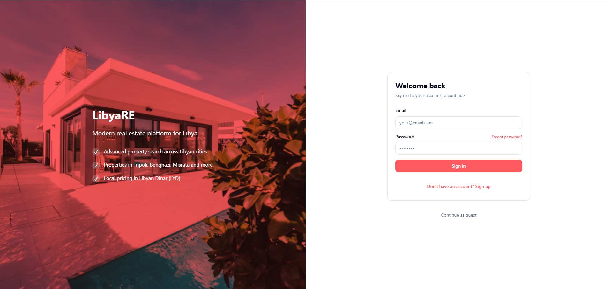
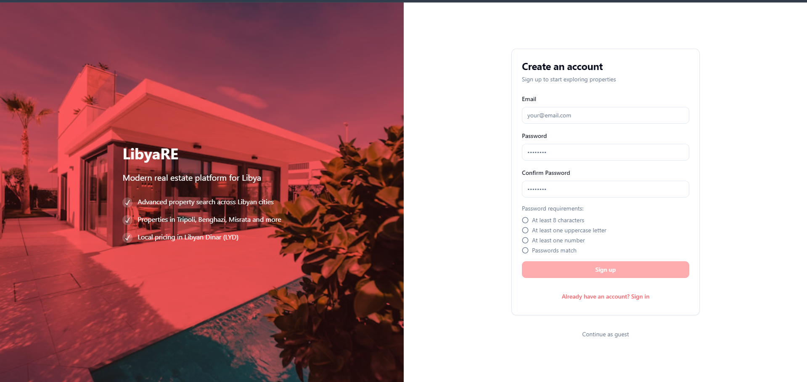
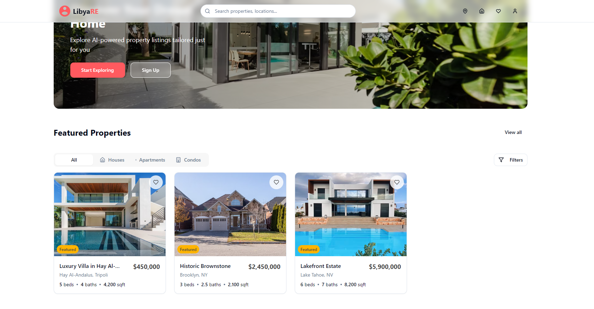
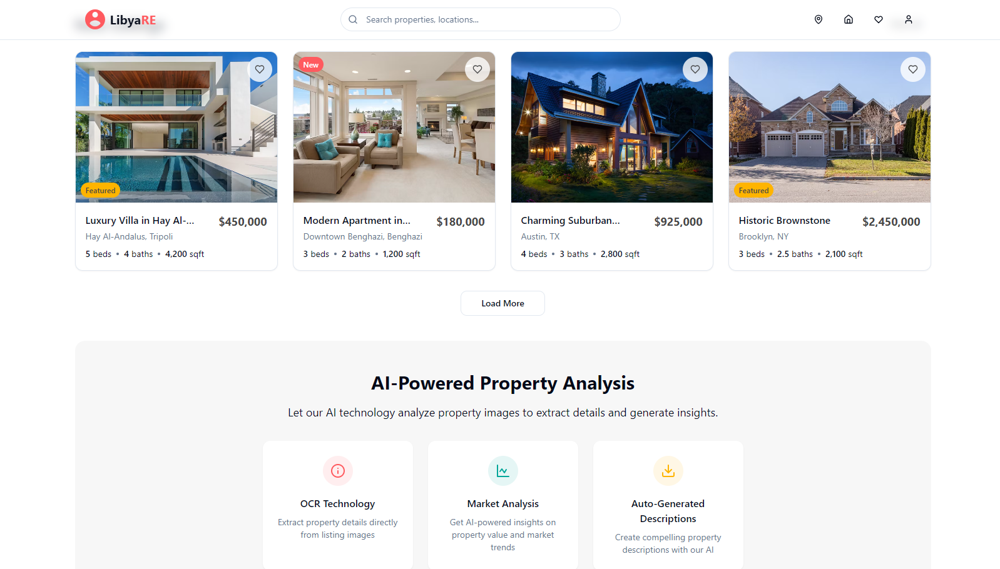
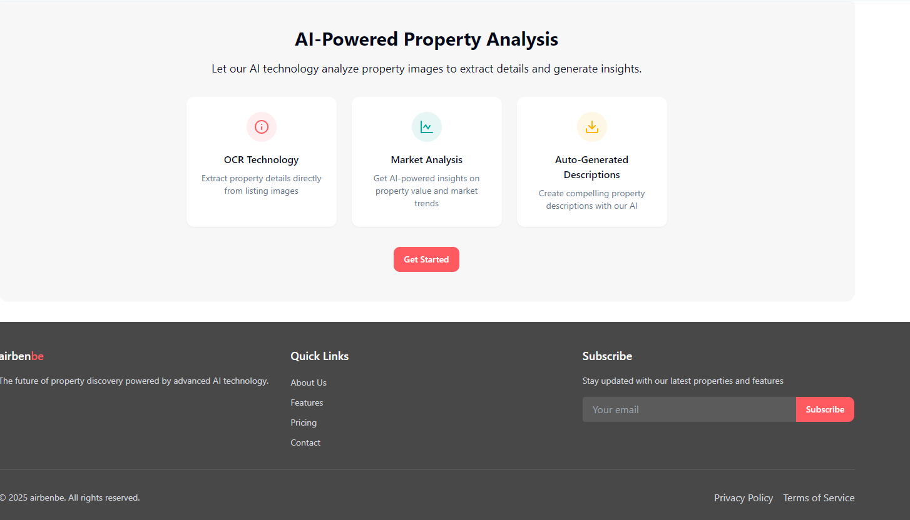
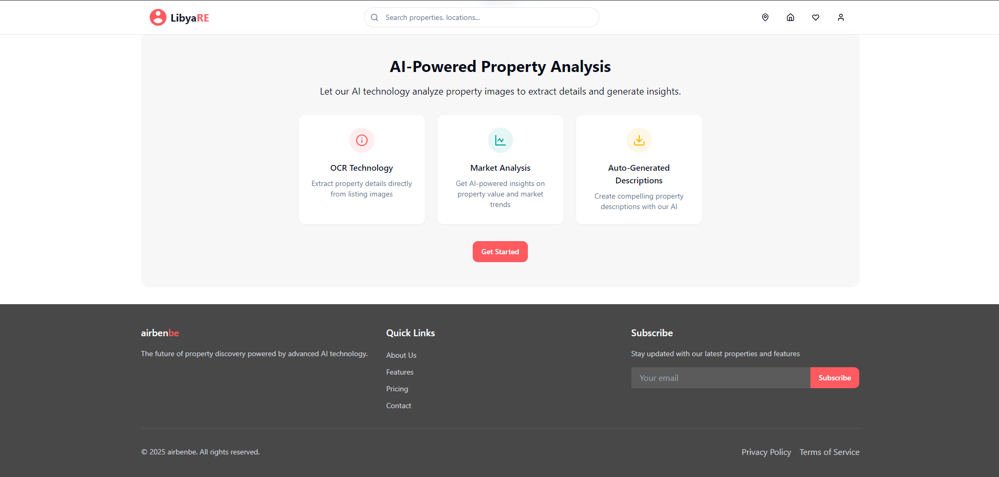
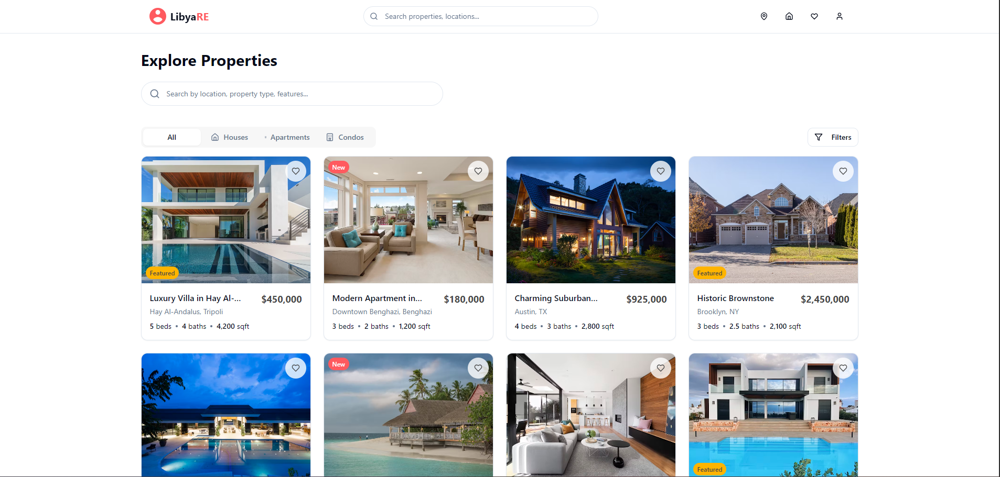

# Libya Real Estate - Modern Property Platform

A modern, AI-powered real estate platform built with React, TypeScript, and advanced UI components. This application provides a comprehensive property browsing experience with intelligent search, filtering, and user management features specifically designed for the Libyan real estate market.

## 📸 Screenshots

### Login

*User authentication page for secure access*

### Signup

*New user registration page for account creation*

### Homepage

*Modern landing page with featured properties across Libyan cities*

### Property Listings

*Advanced filtering and search capabilities for Libyan real estate market*

### Property Details

*Detailed property view with image gallery, map, and contact form in Arabic/English*

### Saved Properties

*User dashboard for managing saved properties with LYD pricing*

### Mobile Responsive

*Fully responsive design optimized for mobile devices with RTL support*

## 🌟 Features

- **🏠 Property Listings**: Browse through curated property listings across major Libyan cities (Tripoli, Benghazi, Misrata)
- **🔍 Advanced Search & Filtering**: Filter properties by type, price range, bedrooms, and location within Libya
- **💾 Save Properties**: Save favorite properties for later viewing
- **📱 Responsive Design**: Fully responsive design that works on all devices with Arabic/English support
- **🖼️ Image Galleries**: Interactive image carousels with full-screen viewing
- **🗺️ Map Integration**: View properties on maps with directions across Libyan cities
- **📝 Contact Forms**: Inquire about properties with integrated contact forms in Arabic and English
- **👤 User Profiles**: Manage user preferences and viewing history
- **🔔 Notifications**: Real-time feedback with toast notifications
- **🌍 Multi-language Support**: Arabic and English language support for Libyan users

## 🛠️ Technology Stack

### Frontend
- **React 18** - Modern React with hooks and context
- **TypeScript** - Type-safe development
- **Vite** - Fast build tool and development server
- **Tailwind CSS** - Utility-first CSS framework
- **shadcn/ui** - High-quality React components
- **React Router** - Client-side routing
- **React Query** - Server state management
- **Lucide React** - Beautiful icons

### Backend & Database
- **Supabase** - Backend-as-a-Service with PostgreSQL
- **Authentication** - Secure user authentication and authorization
- **Real-time Database** - Live property updates and user interactions
- **File Storage** - Property image uploads and management
- **API Integration** - RESTful APIs for property management

### Additional Services
- **Google Maps API** - Property location mapping and directions across Libya
- **Currency Support** - Libyan Dinar (LYD) pricing and conversions
- **Local Integration** - Libyan banking and payment systems
- **Multi-language** - Arabic and English language support
- **Analytics** - User behavior tracking and market insights for Libya

## 🚀 Getting Started

### Prerequisites
- Node.js 18+ and npm installed
- Supabase account for backend services
- Google Maps API key

### Installation

```bash
# Clone the repository
git clone https://github.com/MohammedSalghi/libya-real-estate.git

# Navigate to the project directory
cd libya-real-estate

# Install dependencies
npm install

# Set up environment variables
cp .env.example .env.local
# Add your Supabase and Google Maps API keys

# Start the development server
npm run dev
```

### Available Scripts

```bash
# Development
npm run dev          # Start development server
npm run build        # Build for production
npm run preview      # Preview production build
npm run lint         # Run ESLint

# Backend (Supabase)
npm run db:reset     # Reset database schema
npm run db:seed      # Seed database with sample data
```

## 📸 Screenshots

### Login

*User authentication page for secure access*

### Signup

*New user registration page for account creation*

### Homepage

*Modern landing page with featured properties across Libyan cities*

### Property Listings

*Advanced filtering and search capabilities for Libyan real estate market*

### Property Details

*Detailed property view with image gallery, map, and contact form in Arabic/English*

### Saved Properties

*User dashboard for managing saved properties with LYD pricing*

### Mobile Responsive

*Fully responsive design optimized for mobile devices with RTL support*

## 🏗️ Architecture

### Frontend Architecture
```
src/
├── components/          # Reusable UI components
│   ├── ui/             # shadcn/ui components
│   ├── PropertyCard.tsx
│   ├── PropertyFilters.tsx
│   └── ...
├── pages/              # Route components
├── hooks/              # Custom React hooks
├── lib/                # Utility functions
├── data/               # Static data and types
└── styles/             # Global styles
```

### Backend Architecture
- **Database**: PostgreSQL with Supabase
- **Authentication**: Row Level Security (RLS)
- **API**: Auto-generated REST and GraphQL APIs
- **Storage**: File uploads for property images
- **Real-time**: WebSocket connections for live updates

## 🔧 Environment Variables

```env
VITE_SUPABASE_URL=your_supabase_url
VITE_SUPABASE_ANON_KEY=your_supabase_anon_key
VITE_GOOGLE_MAPS_API_KEY=your_google_maps_api_key
```

## 🚀 Deployment

The application is deployed using modern deployment platforms:

- **Frontend**: Vercel/Netlify for automatic deployments
- **Backend**: Supabase for managed PostgreSQL and APIs
- **CDN**: Cloudflare for global content delivery

### Production Build
```bash
npm run build
npm run preview
```

## 🤝 Contributing

1. Fork the repository
2. Create a feature branch (`git checkout -b feature/amazing-feature`)
3. Commit your changes (`git commit -m 'Add amazing feature'`)
4. Push to the branch (`git push origin feature/amazing-feature`)
5. Open a Pull Request

## 📄 License

This project is licensed under the MIT License - see the [LICENSE](LICENSE) file for details.

## 👤 Author

**Mohammed Salghi**
- GitHub: [@MohammedSalghi](https://github.com/MohammedSalghi)
- LinkedIn: [Mohammed Salghi](https://linkedin.com/in/mohammed-salghi)

## 🙏 Acknowledgments

- [shadcn/ui](https://ui.shadcn.com/) for the beautiful component library
- [Supabase](https://supabase.com/) for the backend infrastructure
- [Tailwind CSS](https://tailwindcss.com/) for the styling system
- [Lucide](https://lucide.dev/) for the icon set
- Libya's growing tech community for inspiration and support
